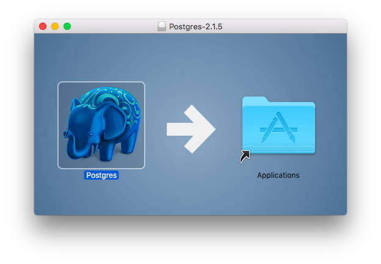

# Introduction to SQL for OSX (Mac)

## Let's Get Started
We shall use PostgreSQL - a widely used relational database. It's open-source and free to use.

**Note that you must be logged in as a user with Administrator privileges on OSX for all these steps.**

From the Macintosh OSX system you can install PostgreSQL from the Postgres.app package. Download this from https://postgresapp.com but make sure you choose PostgreSQL version 10 and the appropriate platform for your Mac. Once you have downloaded Postgres you can open the disk image from your Downloads folder. Drag the Postgres icon to the Applications folder.



Open Applications in the Finder and start Postgres. When you receive the alert **"Postgres" is an application downloaded from the internet...** then click on the Open button. You may be prompted for other options (e.g. auto update, ...) and you can choose your own preference.

When the PostgreSQL window appears then click on the Initialise button to create your local PostgreSQL database and user - they will both have the same name as your OSX username.


PostgreSQL initialises itself, creating the initial databases (template1, postgres and &lt;your user name>) along with corresponding users. These should then be displayed in the PostgreSQL window, as below:


## Configure the Command Line Interface (CLI)
To use the PostgreSQL command line tools you need to add the directory to your path (used to find commands in the terminal). There are several ways to do this but the simplest is to create a file containing the directory path name. Open the terminal and enter the appropriate commands from the list below (note: you may not need to create the directory):
```
    # First check the destination directory exists:
    ls /etc/paths.d/
    # If the directory doesn't exist then create it:
    sudo mkdir /etc/paths.d
    # Create the path entry for Postgres:
    echo /Applications/Postgres.app/Contents/Versions/latest/bin | sudo tee /etc/paths.d/postgresapp
```
From the terminal you can now type the simple command:
```
    psql
```
and this should produce something like the following:
```
    psql (10.5)
    Type "help" for help.

    keith=#
```
The final line is the psql command prompt, waiting for you to enter a command. It comprises your username (in the example this is 'keith') followed by '=#'. Note that to exit psql back to the terminal prompt use the command `\q`.

You can now continue with the main lesson from **"Run the psql Command Line Interface (CLI)"** now but note that the Linux prompt (where it is shown) is not the same as the Mac terminal prompt that you will see.

---
