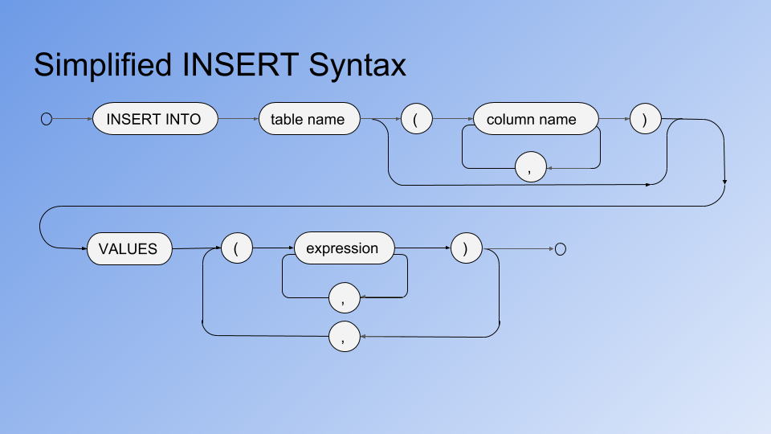

# More Queries
## Objectives
*   Learn how to aggregate data over multiple rows and use aggregate values to restrict the results
*   Combine rows from different tables using JOIN
*   Insert new rows, update existing rows and delete unwanted rows
*   Use sub-queries to access multiple tables in a query
---
## Aggregate Functions
How to calculate totals, averages, etc. over multiple rows.

You frequently need to get a single piece of information that is derived from multiple rows in a table. For example, when you need to know the total income from multiple invoices:

    SELECT sum(total)
       FROM invoices
       WHERE invoice_date BETWEEN
             '2018-08-01' AND '2018-08-31';

The aggregate functions are:
*   sum :   Calculate the total of the values in a column
*   avg :   Calculate the average (mean) of the values in a column
*   min :   Determine the mimimum value of a column
*   max :   Determine the maximum value of a column
*   count : Count the number of values (non-null) in a column

All the above are in the SQL standard, most implementations provide others. SUM and AVG can only apply to numeric data, the others can apply to any datatype.

Further examples:

"What is the average length of stay at our hotel?" :

    SELECT avg(checkout_date - checkin_date)
       FROM reservations;

"What are the lowest and highest room rates we charge?" :

    SELECT min(rate) AS lowest,
           max(rate) AS highest
       FROM rooms;

You can use the count(x) function to count non-null values:

    SELECT count(id) AS id_ct, count(postcode) AS post_ct
        FROM customers;
     id_ct | post_ct
    -------+---------
       133 |     126
    (1 row)

Notice that these two results show different values - there are NULL values for postcode but id is mandatory for all rows.

If you just want to count the number of rows, use count(*) :

    SELECT count(*) FROM customers;

### Grouping Rows for Aggregation
You can calculate aggregates over subsets of rows using the GROUP BY clause:

    SELECT count(*) FROM rooms
       GROUP BY room_type;
     count
    -------
        14
        14
        8
        10
        2
    (5 rows)

What do you notice?

The query calculated the counts correctly but we have no idea which room type each value represents. To solve this we are allowed to include the GROUP BY expressions in the list of selected values, as below:

    SELECT room_type, count(*) FROM rooms
       GROUP BY room_type;
     room_type    | count
    --------------+-------
     PREMIUM      |    14
     PREMIER      |    14
     PREMIER PLUS |     8
     PREMIUM PLUS |    10
     FAMILY       |     2
    (5 rows)

Notice the `room_type` used for GROUP BY is also included in the SELECT list of values.

We can group by multiple expressions, for example:

    SELECT trunc(room_no/100) AS floor,
        to_char(checkin_date, 'YYYY-MM') AS month,
        count(*), sum(no_guests), avg(no_guests)
    FROM reservations
    GROUP BY floor, month;

Notice that the GROUP BY is using the column aliases `floor` and `month` that have been defined in the select list. This works in many, but not all, SQL implementations. (In those that don't allow aliases you must use the full expression, for example: `trunc(room_no/100)` instead of `floor`)

You can use a WHERE clause to restrict the rows that are included in the aggregate function. For example, if we need the above query for only the 2nd and 3rd floors:

    SELECT trunc(room_no/100) AS floor,
           to_char(checkin_date, 'YYYY-MM') AS month,
           count(*), sum(no_guests), avg(no_guests)
       FROM reservations
       WHERE room_no BETWEEN 200 AND 399
       GROUP BY floor, month;

Note that it is NOT usually possible to use column aliases in the where condition.

A WHERE clause is applied before any aggregation, if you need to restrict results using an aggregate function you can't do that using the WHERE clause.

In the above, to return only results with the number of reservations greater than, say, 4 we use the HAVING clause:

    SELECT trunc(room_no/100) AS floor,
           to_char(checkin_date, 'YYYY-MM') AS month,
           count(*), sum(no_guests), avg(no_guests)
       FROM reservations
       GROUP BY floor, month
       HAVING count(*) > 4;    --<< Note the HAVING keyword

The order of clauses in the SELECT statement is:

    SELECT ...
       FROM ...
       [WHERE ...]
       [GROUP BY ...
       [HAVING ...] ]
       [ORDER BY ...]

The square brackets indicate optional clauses. Note that HAVING is only relevant when you have a GROUP BY and must follow it in the SELECT statement.

It can be confusing at first knowing whether to use a WHERE clause or a HAVING clause with GROUP BY.

Use the WHERE clause when values you want to test are available without having to use any aggregate functions (e.g. plain column values).

Use HAVING when the values you want to test are the results of aggregate functions (e.g. count(*), sum(amount), min(x), etc...).

---
## Exercise
1.  Get the numbers of rows in each of the tables: rooms, room_types, customers and reservations.
2.  How many reservations do we have for next month?
3.  Which rooms have been occupied for less than 10 nights and for how many nights have they been occupied?
4.  How many invoices are still unpaid from over a month ago and what is the total owed?
---
## Using Multiple Tables
So far we've only looked at one table in any query. Many problems require data from several tables - how do we do that?

For example, if I want to phone or email customers who have not yet paid their invoices, which tables do I need to look at?

Use joins to combine data from more than one table. Joins use column values to match rows in one table to rows in another.

The join columns are usually referred to as foreign keys and primary keys.

To join reservations and invoices in SQL:

    SELECT r.cust_id, r.room_no, i.invoice_date, i.total
       FROM reservations r JOIN
            invoices i ON (r.id = i.res_id);

Notice:

The new keyword JOIN with ON (predicate)

Table aliases (r and i) used to qualify columns

The new syntax follows the following pattern:

    SELECT ...
      FROM ... [JOIN ... ON (...)]...
      [WHERE ...]
      [GROUP BY ... [HAVING ...] ]
      [ORDER BY ...]

Use the JOIN to define the combined row source then you can use WHERE, DISTINCT, GROUP BY, ORDER BY, etc... as with single-table queries. For example:

    SELECT r.cust_id, r.room_no, i.invoice_date, i.total
      FROM reservations r JOIN
           invoices i ON (i.res_id = r.id)
      WHERE r.checkin_date > '2018-07-01'
        AND i.total < 500
      ORDER BY i.invoice_date DESC, r.cust_id;

There is no theoretical limit to the number of tables that can be joined in a query, although practical considerations like complexity and performance must be considered. It is quite common, though, to find up to seven or eight tables joined in a query.

Mult-table joins just extend the syntax to add more tables, as below:

    SELECT c.name, c.phone, c.email, i.invoice_date, i.total
      FROM customers c JOIN
           reservations r ON (r.cust_id = c.id) JOIN
           invoices i ON (r.id = i.res_id)
      WHERE i.invoice_date < current_date - interval '1 month'
        AND i.paid = FALSE
      ORDER BY i.invoice_date DESC, c.id;

---
## Exercise
1.  Which customers occupied room 111 and what are their details?
2.  List the customer name, room details (type and rate), nights stay and departure dates for all UK customers.
3.  List name, phone and email along with all reservations and invoices for customer Mary Saveley.
---
## Inserting Data Into a Table
We can use a simple INSERT command in SQL:

    INSERT INTO invoices (res_id, total, invoice_date)
      VALUES (92, 73.50, current_date);

Each such INSERT command adds one row to the specified table. Some dialects of SQL allow multiple row inserts in the same command, for example:

    INSERT INTO invoices (res_id, total, invoice_date)
      VALUES (92, 73.50, current_date),
             (97, 132.75, current_date);

SQL syntax is often represented in diagramattic form, as follows:

You can insert multiple rows from another table:

    INSERT INTO invoices (res_id, total, invoice_date, paid)
      AS SELECT booking_id, amount, invdate, complete
           FROM old_invoices;

This type of command can be useful for restructuring data or changing a table definition.

---
## Updating Existing Data
You will often need to change the data in existing rows (e.g. a customer checks in and is assigned a room number).

    UPDATE reservations
      SET room_no = 213
      WHERE id = 97;

The WHERE clause defines which row(s) are to be updated, the SET clause specifies which column(s) are to be changed.

**Beware - no WHERE clause = all rows!**

An UPDATE command can change more than one column:

    UPDATE reservations
      SET room_no = 205, checkout_date = currdate + 4
      WHERE id = 103;

The customer has requested a change to the booked checkout date and after ensuring the room is available, the clerk accepts the change.

## Deleting Rows
Unless your database can expand indefinitely you will eventually need to delete redundant data.

    DELETE FROM invoices
      WHERE invoice_date < '2017-01-01'
        AND paid = TRUE;

Note that the same warnings about WHERE clauses apply as for UPDATE:

**Beware - no WHERE clause = all rows!**

---
## Exercise
1.  Add new customers as below:

&nbsp;&nbsp;&nbsp;&nbsp;&nbsp;&nbsp;&nbsp;&nbsp;
John Smith
&nbsp;&nbsp;&nbsp;
john@johnsmith.org

&nbsp;&nbsp;&nbsp;&nbsp;&nbsp;&nbsp;&nbsp;&nbsp;
Sally Brown
&nbsp;&nbsp;&nbsp;
sally.brown123@nowhere.com

2.  Update your new customer records with address, city, country and post code details (you can make these up).
3.  Delete all paid invoices dated more than one month ago.
4.  Update reservation id 33 with a new room number 303 and a checkout date of 5 days after checkin (as you might when a customer checks in).

---
## The Vexing Question of NULL
A column can be assigned a NULL value to indicate it has no value. This can happen when the data for this column is unknown at the time the row is created, for example, employee leaving date, order shipment date, etc... It can also be used when the data is optional.

Be careful with expressions - any expression that includes a NULL value results in NULL as the expression value.

Because NULL is 'no value' it cannot be compared to anything else. For example, you will never get any results from:

    SELECT * FROM customers WHERE postcode = NULL;

nor will you get any from:

    SELECT * FROM customers WHERE postcode != NULL;

Instead you must use:

    ... WHERE postcode IS NULL

or

    ... WHERE postcode IS NOT NULL

This behaviour has some impacts on operations like JOIN, where NULL values won't match. You could work around this by using:

    ... ON (a.col = b.col OR
            a.col IS NULL AND b.col IS NULL)

However, be warned that this is not a sensible situation - join columns containing NULL should be expected to not match or should be disallowed (see Primary Keys later)

You can explicitly provide NULL as a value in INSERT and UPDATE statements, for example:

    INSERT INTO rooms (room_no, rate, room_type, no_guests)
      VALUES (213, 95.00, NULL, 2);

    UPDATE rooms SET room_type = NULL, no_guests = NULL
      WHERE room_no = 204;

In INSERT statements if you omit a column from the column list (following the table name) then that column will be given either:
* an autogenerated value (if it has datatype SERIAL)
* a default value if one has been specified in the CREATE TABLE command
* NULL if neither of the above apply

There are some functions that can operate on NULL values, especially the `coalesce(x, y)` function. This function looks at the first argument `x` and if it is NULL returns the value of the second argument `y` otherwise it returns the value of `x`. For example:

    SELECT room_no, rate, coalesce(room_type, 'None') type
      FROM rooms
      WHERE no_guests IS NULL;

Notes:
* The coalesce function can take more than two arguments and returns the first of these (from left to right) that is not null.
* This feature is provided by most SQL vendors but goes by different names, e.g. ifnull(x, y) in MySQL, nvl(x, y) in Oracle, etc...

---
## Exercise
1.  Which customers have not yet provided a phone number?
2.  Update room 304 such that it does not have a room_type.

---
## Subqueries
It is sometimes necessary to base the results of one query on what you get from another, for example, to find all customers from the same country as Mary Saveley:

    SELECT country FROM customers
      WHERE name = 'Mary Saveley';
    ...
    SELECT * FROM customers
      WHERE country = <result from 1st query>;

This is very clumsy, you have to retype the result of the first query in the second. It would be much better to have just one query that works for whatever name we provide!

We can rewrite that as:

    SELECT * FROM customers
      WHERE country = (
            SELECT country FROM customers
              WHERE name = 'Mary Saveley');

* Subqueries are always enclosed in parentheses (...).
* The subquery provides the value for country required by the WHERE condition.
* Notice that the subquery is written last but is executed first, as in the original two query solution.

You can use a subquery on the RHS of a predicate, of the form:

    ... WHERE col <op> (SELECT ...) ...

`<op>` is a comparison operator such as `=`, `>`, `<=`, etc.

For example:

    SELECT * FROM reservations
      WHERE (checkout_date - checkin_date) > (
          SELECT avg(checkout_date - checkin_date)
            FROM reservations);

What question does this query answer - remember that the inner query is executed first to provide a result to feed into the outer query.

Subqueries can also be used to check for the existence (or non-existence) of rows in other tables by using the EXISTS or NOT EXISTS keywords, for example:

    SELECT * FROM customers c
      WHERE NOT EXISTS (SELECT 1 FROM reservations r
                          WHERE r.cust_id = c.id);

This example lists all customers who have no reservations currently.

It is also an example of a correlated subquery.

Correlated subqueries use values from the outer query - in this case the subquery can't execute first, they must both execute together.

For example:

    SELECT c.name, c.country,
           r.checkout_date - r.checkin_date as nights
      FROM customers c
      JOIN reservations r ON (r.cust_id = c.id)
      WHERE r.checkout_date - r.checkin_date =
            (SELECT max(y.checkout_date - y.checkin_date)
              FROM customers x
              JOIN reservations y ON (y.cust_id = x.id)
              WHERE x.country = c.country);

Notice that the inner query is using the value of `c.country` from the outer query. This lists the customers who have stayed the longest in the hotel from their country (e.g. which americans have stayed the longest of all americans, etc...)

You can use subqueries in many places where you would use a column name or a table name. For example:

    SELECT name, email,
           (SELECT count(*) FROM reservations r
             WHERE r.cust_id = c.id) bookings_made
      FROM customers c
      WHERE country = 'USA';

Returns name, email and the number of reservations for all USA customers.

This is another example of a "correlated subquery" when the subquery uses a value from the outer query (c.id in this case).

You can use a subquery in place of a table (in postgreSQL you must always use a subquery alias for these). For example:

    SELECT MAX(sumn) AS max_cust_nights
      FROM (SELECT SUM(checkout_date - checkin_date) AS sumn
              FROM reservations
              GROUP BY cust_id
           ) AS sub1;

You can use this construct in a wide variety of contexts. One classic use is in SQL dialects that don't support nested aggregate functions you can use a subquery to find things like `MAX(SUM(expr))`.

---
## Lesson Summary
In this lesson you have learned how to:
* Aggregate data over multiple rows and use aggregate values to restrict the results
* Combine rows from different tables using JOIN
* Insert new rows, update existing rows and delete unwanted rows
* Use sub-queries to access multiple tables in a query

---
## Homework
1.  Complete any exercises you have not yet finished from this lesson.
2.  Go to https://blog.logrocket.com/setting-up-a-restful-api-with-node-js-and-postgresql-d96d6fc892d8
and read the tutorial (DON'T try to install or run anything just yet!)
3.  Look at the CYF Hotel app and see whether you can define the SQL you'll need to implement the different endpoints. Don't implement the endpoints yet but do try out the SQL if you have time.

---
