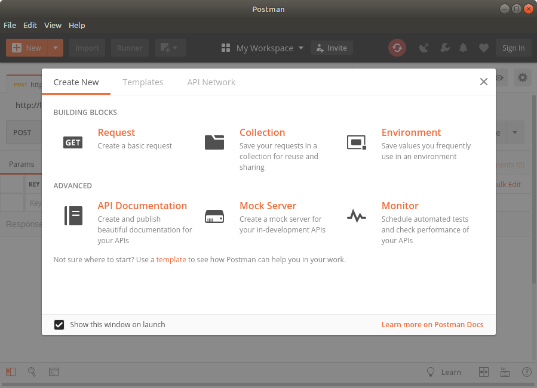
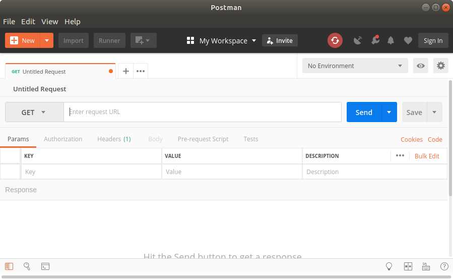

# SQL With Node
**Using SQL with Node.js, express and PostgreSQL**

---
## Objectives
* Use Nodejs and Express with SQL
* Create endpoints (routes) to execute queries that return multiple rows
* Create endpoints to execute queries that return one row
* Create endpoints to insert new data into a table
* Create endpoints to delete a row from a table

---
## Setting Up the Environment
1.  If not already done, fork and clone the repository: https://github.com/CodeYourFuture/cyf-hotel-db
2.  If necessary use `npm install` to install dependencies.
3.  Install Postman
    1. Linux: Search in Ubuntu Software for Postman then install
    2. Mac: download & extract zip file to folder ???
    3. Windows: Download & run .exe file

For Mac & Win see https://www.getpostman.com/apps

### What is Postman?
*   Postman simulates a browser environment by emulating the API calls made from HTML/Javascript to the server
*   It gives you a view of the messages received from the server in their raw form
*   It’s great for testing and debugging
*   It doesn’t render the results - that comes later… (See React sessions)

---
## Preamble
To access your database from Node you should give yourself a password. This is very easy...

From the terminal, log in to your database with `psql` and issue the SQL command:

    ALTER ROLE <your user name> PASSWORD '<password>';

Note: \<your user name\> is your Ubuntu user; the \<password\> can be anything you choose. Quit from psql using the \q command.

Install the Nodejs support for postgres:

    npm install pg --save

Edit your class2.js API file so that you can access your database. First add these lines near the top of the file:

    const Pool = require('pg').Pool;

    const conn = new Pool({
      user: '<yourUserName>',      // Your Ubuntu user name
      host: 'localhost',
      database: '<yourUserName>',  // ... and again.
      password: '<password>',      // The one you gave yourself above
      port: 5432,
    });

## Starting with SQL in Express
When you've provided the preamble above you can execute SQL using:

    . . .
    conn.query('<put SQL here>', function(err, rows) {
      if (err) {
        throw err;
      }
      <process rows here>
    });

## Exercise
Check that you can connect and run SQL from node. Create a file, say, sqltest.js containing something like this:

    const Pool = require('pg').Pool;

    const conn = new Pool({
      user: '<yourUserName>',      // Your Ubuntu user name
      host: 'localhost',
      database: '<yourUserName>',  // ... and again.
      password: '<password>',      // The one you gave yourself above
      port: 5432,
    });

    conn.query('SELECT * FROM customers WHERE id = 32', (err, result) => {
      if (err) {
        throw err;
      }
      console.log(result);
    });

This should return a complex object that contains a `rows` element with the details for customer 32, as follows:

    ...
    rows:
     [ { id: 32,
        name: 'Keith Franco',
        email: 'keith.franco@dlha.net',
        phone: '2035557845',
        address: '149 Spinnaker Dr., Suite 101',
        city: 'New Haven',
        postcode: '97823',
        country: 'USA' } ],
    fields:
    ...

Notice the structure of the `rows` element - it's an array with each element an object representing one row (there is only one row in this case, of course). Think carefully about how you can access each column value returned.

Change your code so that it logs each returned column to a separate line along with its column name. (Hint: use `for (var x in y) {...}`).

---
## Starting with SQL in Express
Examine the file `class2.js` in the api directory. You should have already added the "preamble" discussed earlier to enable a connection to your database.

We need to modify the code for the `/customers` endpoint so that it returns all customers; the code in `class2.js` would be:

    router.get("/customers", function(req, res) {
      var sql = "SELECT name, email, phone," +
                " address, city FROM customers";
      conn.query(sql, function (err, result) {
        result.rows.forEach(function (row) {
          console.log(row.name, row.email, row.phone,
                    row.address, row.city);
        });        // ends forEach...
      });          // ends conn.query callback function
    });

Looking at the details of the above, we see:

      var sql = "SELECT name, email, phone," +
                " address, city FROM customers";

This is fairly obvious - it's a variable `sql` that is set to a string value representing an SQL SELECT statement to retrieve details for all customers (there's no WHERE clause).

Then there is:

      conn.query(sql, function (err, result) {

This uses the `conn` connection initialised in the preamble to issue the SQL command in `sql` to the database then provides a callback function to process the resulting data.

        result.rows.forEach(function (row) {
          console.log(row.name, row.email, row.phone,
                    row.address, row.city);
        });        // ends forEach...

Is the body of the callback function which iterates over all the elements of the `result.rows` array and sends the name, email, phone, address and city column values to the console.

### Check the Endpoint Works
Start (or restart) the server.js file (in a terminal):

    $ node server.js

In the browser, enter the URL for the customers endpoint:

    http://localhost:8080/api/customers

Back to the terminal - can you see the list of customers logged to the console?

If not you need to correct any mistakes (ask your mentor if you are stuck).

---
## Return Results as JSON
To be useful the endpoint must return the results to the browser. We’re going to use JSON. Edit the endpoint:

    ...
    conn.query(sql, function (err, rows) {
      rows.forEach(function (row) {
        console.log(row.name, row.email, ...);
      });
      res.status(200).json({        // Add these lines...
          customers: rows           // here...
      });                           // and here.
    });
    ...

Note: for the moment we'll leave the console log of records in place, in case there's a problem with the new code. It then shows we've run the callback function even if the JSON isn't returned.

In the browser reload the customers endpoint page. The previous time you did this the page was just blank - you should now see the returned JSON structure with details of all customers.

Note: different browsers render the JSON differently - some provide more features than others.

### Use Postman to Check the Response
We can ensure we see a consistent view of the returned JSON by using another tool to manage the Express API. We've previously installed Postman - find it on your system and run it (it's slow to start - be patient). If you see a "Signup" window at first just close it - there is no need to sign up. The initial window (as below, with the Create New tab) can also be closed.



You can use the main Postman window (below) to initiate requests to and handle responses from web servers. In our case this is the local server we have set up using NodeJS.



Ensure that the HTTP request method is set to GET (if not then change it using the drop-down list).

Enter the customers endpoint url (http://localhost:8080/api/customers) in the field that has "Enter request URL" initially.

Click the blue Send button.

You should see the returned JSON in a fairly readable format (under the Pretty tab) as in the following snippet:

    {
        "customers": [
            {
                "id": 1,
                "name": "John Smith",
                "email": "j.smith@johnsmith.org",
                "phone": "0151 123 4567",
                "address": "11 New Road",
                "city": "Liverpool"
            },
            {
                "id": 2,
                "name": "Sue Jones",
                ... etc ...

### Being More Selective
Returning all the customers is fine for a small number of rows, but if we have 200,000 customers it becomes a bit unwieldy.

If we know the id of the customer we can query for just one.

Add code for a new endpoint: /customers/:id

    conn.query("/customers/:id", function(req, res) {
      // TODO: add code here
    });

Note: this endpoint has already been provided as above in class2.js - you just need to add the code for the body.

First, get the id from the request:

    var id = req.params.id;

Next, use the id in the SQL query:

    conn.query("SELECT … FROM customers WHERE id = $1", [id],
                function (err, row){
        // we’ll add code here next ...
    });

Note the $1 placeholder in SQL matches the id in the array (2nd param). The value of id will replace the $1 when the SQL is executed. (Note that the placeholders are numbered from 1 - not 0)

If you need to provide more than one value you can use placeholders $2, $3, $4, etc...

Finally, we return the row from the query:

    conn.query("SELECT … FROM customers WHERE id = $1", [id],
        function (err, result){
        res.status(200).json({
            customer: result.rows[0]
        });
    });

Note that we return only the first element (`rows[0]`) of the rows array because we know that `id` matches only one row. If the query could return more than one row then we need to return the whole array (as we did in the case for all customers).

So now the full endpoint looks like this:

    router.get('/customers/:id', function(req, res) {
        // TODO add code here
        var id = parseInt(req.params.id);
        var sql = "SELECT id, name, email, phone," +
                    " address, city FROM customers WHERE id = $1";
        conn.query(sql, [id], function (err, result) {
            res.status(200).json({
                customer: result.rows[0]
            });
        });
    });

Use Postman to check the response, the URL for customer id = 3 is: `http://localhost:8080/api/customers/3`

---
## Exercise
1.  Make sure you have defined the endpoints for:
    1.  Getting all customers
    2.  Getting a single customer by id
2.  Using a method similar to the one used to get a customer by id, define an endpoint that can get customers by matching part of the name (e.g. endpoint /customers-by-name).

> Remember there may be more than one matching row!

3.  Test all these endpoints with Postman and ensure the results are as expected.

---
## Inserting Rows Using Node.js
To insert rows into our tables we use a POST instead of a GET method. We define an endpoint in server.js:

    app.post("/customers/", function (req, res) {
        // add code here to insert row...
    });

The browser sends the values for the new row as JSON in req.fields. We can extract them using body-parser into variables:

    var nam = req.body.name;
    var phn = req.body.phone;
    var eml = req.body.email;
    var add = req.body.address; // ...etc.

(Note: for formidable use `req.fields` instead of `req.body`)

Issue an SQL INSERT command with values and use $n placeholders for inserted values, for example:

    conn.query("INSERT INTO customers " +
                "(name, email, phone, address) " +
                "VALUES ($1, $2, $3, $4)",
            [nam, eml, phn, add],
        function(err) {
            // callback code goes here
        });

We use the conn.query method even though this isn't strictly a query - think of query as any form of SQL for this purpose.

### What Can We Do After an Insert?
*   We should staKeithrt checking for errors! Not just for inserts!
*   If the table uses an autoincrementing PK we might return the value (that could be useful).
*   We could console.log the inserted data
And so forth...

#### Check for Errors
We should really provide error handling in each endpoint to deal with database errors that could occur anywhere we execute SQL. This should include queries.

The callback function always includes an error parameter as the first parameter. It’s undefined if the command succeeded, or a message if an error occurred.

    do.something(..., function (err) {
        if (err == null) {
            // do stuff for success
        } else {
            res.status(500).json({error: err});
        };
    });

In this example do.something stands for any of the database actions such as conn.query. Calling res.status with parameter 500 signals an error response to the browser, terminates the endpoint action and sends the error message as JSON so the browser can display it or take some other action.

#### Return the Primary Key Value for an Insert
With auto-generated primary keys it might be helpful for the browser to be given the value of the new key after an insert.  In postgres the simplest way to do this is by modifying the INSERT statement, as follows:
GET
    INSERT INTO table (cola, colb, colc, ...)
        VALUES (expr1, expr2, expr3, ...)
        RETURNING id;

The RETURNING clause is not standard SQL but is very useful in this context in PostgreSQL as it allows the insert to also perform a very efficient query after successfully inserting the new row. You can try this in psql.

In the case of SQL executed through Node and Javascript we need to add the RETURNING clause to the INSERT statement then pick up the value from the result of the query. That looks something like this:

    conn.query("INSERT INTO customers " +
                "   (name, email, phone, address) " +
                " VALUES ($1, $2, $3, $4)" +
                " RETURNING id",
            [nam, eml, phn, add],
        function(err, result) {
            var newId = result.rows[0].id;
            ...
        })

### INSERT - Putting it All Together

    router.post("/customers/", function (req.res) {
        var nam = req.fields.name;
        var eml = req.fields.email;
        var phn = req.fields.phone;
        // etc...
        conn.query("INSERT INTO customers (name, email, phone)" +
                   "  VALUES ($1, $2, $3) RETURNING id",
            [nam, phn, eml], function(err, result) {
            if (err == null) {
                var newId = result.rows[0].id;  //get the PK
                console.log("New customer id = ${rowid}");
                res.status(200).json({lastId: newId});  // return the PK
            } else {
                res.status(500).json({error: err});
            };
        });
    });

To test the Insert command from Postman:
1. Change the method to POST
2. Change the 'Params' just below the method to Body
3. On the line below select to 'raw'
4. Select JSON(application/json) instead of Text (dropdown list)
5. Type in the JSON for the new customer in the input area. This should look like:
```
    {
        "name": "Fred Bloggs",
        "email": "fred.bloggs@wxyz.net",
        "phone": "+44 7890 123456",
        "city": "Manchester",
        "country": "UK"
    }
```
6. Click Send then check the Params tab for the new id

Note: this would normally be done in React by JS code to send via Ajax after completing the form with new details.

---
### Exercise
Using the same approach we used for customers, write an endpoint to insert new reservations to the database. Remember that a reservation reserves a room for a customer for a specified date or date range and for a number of guests.
1.  Add error checking to all your endpoints.
2.  Create the endpoint using the POST method for endpoint /reservations.
3.  Ensure that you provide all the needed values in the form data.
4.  Use Postman to check that your endpoint inserts the new reservation and returns the new id value.

---
## Deleting Rows
To delete rows we must provide some way to identify the row (or rows) that we wish to delete. We have already queried customers based on id - we could use a similar technique to delete rows using id.

Create an endpoint for customers using the DELETE method and passing a parameter for the id of the customer to be deleted, as below:

    router.delete("/customers/:id", function(req, res) {
      // TODO add code here
      });

---
### Exercise
Using what you already know of SQL and NodeJS/express you should be able to complete that endpoint with the relevant steps to delete a customer when given the id of that customer.
1.  Remember to provide a WHERE clause to govern the rows deleted.
2.  Ensure you include error checking code in your endpoint.
3.  You don't need to return anything to the browser except status (or error message if an error occurs).

---
## Transactions
By default, PostgreSQL runs each INSERT, UPDATE or DELETE in its own transaction - it either succeeds or fails. But the ACID rules require us to be able to make several changes that either all succeed or all fail. To do this we use a transaction.

For example, in banking, a money transfer between accounts must debit the ‘from’ account and credit the ‘to’ account as a single operation - but this needs two update commands. So...

Start a transaction using the command:

    BEGIN TRANSACTION;

… then issue INSERT, UPDATE and/or DELETE commands

End the transaction with either:

    COMMIT;        -- make changes permanent

or:

    ROLLBACK;    -- undo changes since last BEGIN
### ACID Rules
ACID is a mnemonic for:

* Atomic - all related changes succeed or all fail
* Consistent - committed changes leave the database
consistent (all rules obeyed)
* Isolation - users always see a consistent image, can’t see
incomplete changes
* Durable - committed changes are permanent (even after
power failure)

### Exercise
Change all your endpoints that change the database (that is, use INSERT, UPDATE or DELETE) such that each of the changes take place in the context of a transaction.

NOTE: This is not strictly necessary, since all the changes we have made involved only a single statement each time.  However, if the app changed at some future date to include other actions, these might need the transaction mechanism to make them safe.

---
## Homework
